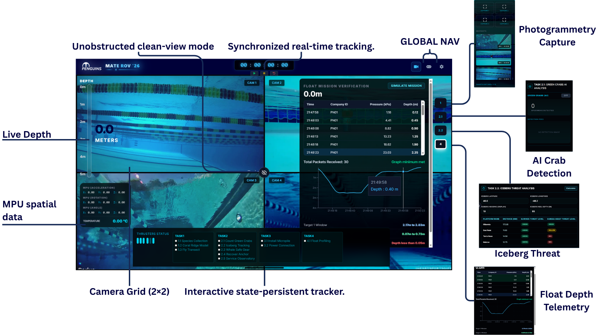
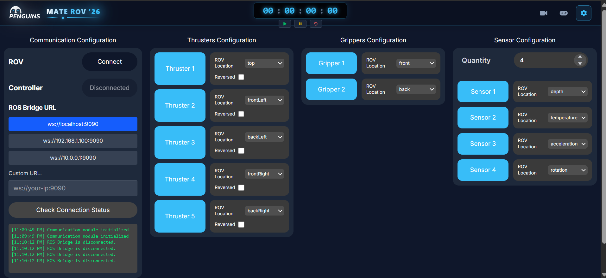
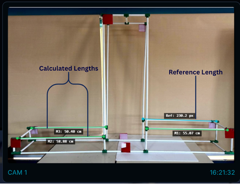

# IEEE Penguins - MATE ROV 2026 Ground Control Station (GUI)

A full-stack, mission-critical Remotely Operated Vehicle (ROV) Ground Control Station and telemetry system built for the **MATE ROV Competition 2026**, featuring low-latency teleoperation, ROS 2 Bridge integration, multi-camera cockpit HUD, real-time photogrammetry, and autonomous float profiling analytics.

---

## Problem
In the high-stakes underwater environment of the **MATE ROV 2026 Competition**, piloting a custom subsea Remotely Operated Vehicle requires deterministic control, high-definition spatial awareness, and instant execution of complex computational tasks under a strict 15-minute mission window. 

The system coordinates interactions across three distinct layers: the human pilot and copilot, the surface ground station, and the submerged vehicle computer (ROS 2 running on an onboard companion computer communicating with thruster ESCs, servo manipulators, and sensor suites). The engineering challenge involves solving several core operational problems:
- **Low-Latency Teleoperation:** Translating high-frequency dual-analog gamepad inputs into a 6-thruster holonomic vectoring allocation matrix (surge, sway, heave, yaw) and multi-axis manipulator servos without introducing command lag or saturating network bandwidth.
- **Heterogeneous Hardware & Protocol Bridging:** Unifying disparate hardware communication channels—including ROS 2 topics over WebSockets (`roslib`), browser Gamepad APIs, and wireless microcontrollers—into a unified, reactive control deck.
- **Mission Task Analytics (MATE 2026 Challenge Tasks):**
  - **Task 1 (Seabed 2030):** Performing subsea camera freeze-frame photogrammetry to calibrate pixel-to-centimeter ratios and measure biological specimens and coral structures.
  - **Task 2 (SmartAtlantic Alliance):** Real-time AI object detection and specimen counting for invasive European Green Crabs, combined with an analytical navigational solver computing Great Circle (Haversine), initial bearing, and cross-track distance calculations to assess iceberg collision threats against subsea infrastructure (categorized into Red/Yellow/Green threat tiers). Additionally, servicing the Holyrood Observatory eDNA station with biodiversity relative abundance calculations.
  - **Task 3 (Wind-Powered Platform):** Precision teleoperation for subsea connector dockings and micropile/bubble-curtain deployments.
  - **Task 4 (Ocean Observing System - Float Profiling):** Ingesting wireless telemetry from an autonomous profiling float over Wi-Fi (HTTP REST & Socket.IO), requiring persistent append-only storage and live profile charting without losing packets during pool surface transitions.
- **Fault-Tolerant State Recovery:** Surviving unexpected tether blips, process restarts, or browser refreshes without losing mission timers, scored subtasks, or sensor history.

---

## Architecture
The system adopts a **decoupled three-tier distributed architecture** optimized for low-latency command streaming, fine-grained UI reactivity, and telemetry durability:

```
┌───────────────────────────────────────────────────────────────────────────────────┐
│                           PILOT & COPILOT STATIONS                                │
│                                                                                   │
│   ┌───────────────────────────┐           ┌───────────────────────────────────┐   │
│   │   HTML5 Gamepad API       │           │   React 19 + TypeScript Cockpit   │   │
│   │   (20 Hz Polling Loop)    │           │   • Multi-Cam HUD & Overlays      │   │
│   │   • Deadband Filtering    │           │   • Canvas Photogrammetry (Task 1)│   │
│   │   • Payload Diffing       │           │   • Iceberg Threat Solver (Task 2)│   │
│   └─────────────┬─────────────┘           │   • Float Profile Chart (Task 4)  │   │
│                 │                         └─────────────────▲─────────────────┘   │
└─────────────────┼───────────────────────────────────────────┼─────────────────────┘
                  │                                           │
                  │ WebSocket (Socket.IO)                     │ Atomic State Updates
                  │ (Low-latency bidirectional events)        │ (Jotai Store)
                  ▼                                           │
┌─────────────────────────────────────────────────────────────┴─────────────────────┐
│                       GROUND CONTROL SERVER (Node.js & Express 5)                 │
│                                                                                   │
│   ┌────────────────────────────────┐         ┌────────────────────────────────┐   │
│   │      Socket.IO Event Hub       │         │      REST Telemetry Ingress    │   │
│   │  • Kinematics Mapping Matrix   │         │  • POST /api/float/packet      │   │
│   │  • Iceberg Geodesic Calculator │         │  • POST /api/float/packets     │   │
│   │  • Config Management & Tests   │         │  • GET  /api/float/packets     │   │
│   └─────────────┬──────────────────┘         └───────────────┬────────────────┘   │
│                 │                                            │                    │
│                 │                                            ▼                    │
│                 │                            ┌────────────────────────────────┐   │
│                 │                            │       Persistence Engine       │   │
│                 │                            │  • floatMissionPackets.jsonl   │   │
│                 │                            │  • rovConfiguration.json       │   │
│                 │                            │  • icebergResult.json          │   │
│                 ▼                            └────────────────────────────────┘   │
│   ┌────────────────────────────────┐                                              │
│   │    ROS 2 Bridge Connector      │                                              │
│   │    (roslib / WebSocket Client) │                                              │
│   └─────────────┬──────────────────┘                                              │
└─────────────────┼─────────────────────────────────────────────────────────────────┘
                  │
                  │ ROS Bridge WebSocket Protocol (`ws://<companion-ip>:9090`)
                  ▼
┌───────────────────────────────────────────────────────────────────────────────────┐
│                        ONBOARD VEHICLE SYSTEM (ROS 2 Humble / Iron)               │
│                                                                                   │
│   Topics:                                                                         │
│   ├── /rov/command      (std_msgs/String)             ◄── Thruster & Servo PWMs   │
│   ├── /rov/sensors      (std_msgs/String)             ──► IMU, Depth, Temp        │
│   ├── /crab_count       (std_msgs/Int32)              ──► AI Green Crab Tally     │
│   ├── /AI_Detection     (sensor_msgs/CompressedImage) ──► Inference Video Stream  │
│   └── /cam_*/image_raw  (sensor_msgs/Image)           ──► Subsea Video Feeds      │
└───────────────────────────────────────────────────────────────────────────────────┘
```

- **Frontend Client (React 19 + TypeScript + Vite):** Uses an **Atomic State Pattern** powered by **Jotai**. Individual sensor values, controller states, and mission progress exist as isolated atoms. High-frequency updates (e.g. IMU telemetry or controller triggers) trigger re-renders only in the specific badges or meters displaying them, preventing re-render cycles across the video feeds and HUD overlays. Persistent atoms (`atomWithStorage`) automatically mirror mission progress and calibrations to browser `localStorage`.
- **Node.js Telemetry Middleware:** Acts as the centralized bridge and validation layer. Manages Socket.IO client connections, computes thruster vector matrices, evaluates iceberg trajectory vectors, and ingests Task 4 autonomous float packets.
- **ROS 2 Bridge Layer (`roslib`):** Connects the Node.js server to the subsea companion computer over a WebSocket tunnel. Eliminates the need for native ROS 2 environments on client operating systems while providing full access to native ROS topics (`/rov/command`, `/rov/sensors`, `/crab_count`, `/AI_Detection`).
- **Persistence Layer:** Synchronous, lightweight append-only logging for float telemetry (`.jsonl`), ensuring mission data survives crashes without requiring an external database engine.

---

## Technology Choices
- **React 19 & TypeScript:** Provides compile-time type safety across complex sensor schemas, controller payloads, and mission models, preventing runtime errors during competition runs.
- **Vite 6:** Rapid compilation, instant hot-module replacement (HMR), and optimized production asset bundling.
- **Tailwind CSS v4:** Modern utility-first styling configured with an ultra-dark cockpit aesthetic, high-contrast HUD overlays, and zero-runtime CSS overhead.
- **Jotai (Atomic State Management):** Replaces monolithic stores (like Redux) to prevent cascading UI re-renders. Sensor metrics updating at 20–50 Hz update only their discrete DOM nodes.
- **Node.js & Express 5:** Non-blocking asynchronous event loop suited for streaming telemetry, hosting REST ingestion endpoints, and maintaining WebSocket pipes.
- **Socket.IO 4.8:** Provides low-latency, bidirectional, event-driven communication with automatic heartbeat detection, reconnection logic, and event multiplexing.
- **ROS 2 & roslib:** Standards-compliant robotics integration allowing direct interoperability with ROS 2 nodes, publishers, and subscribers running on the ROV's onboard Linux computer.
- **HTML5 Gamepad API & HTML5 Canvas API:** Direct low-level access to game controllers and hardware-accelerated 2D canvas manipulation for real-time subsea freeze-frame photogrammetry.
- **Recharts:** Responsive SVG charting engine for live visualization of Task 4 vertical float dive/ascent profiles and stability tracking.
- **JSON Lines (`.jsonl`):** Human-readable, append-only disk storage format for sensor packets that ensures instantaneous write performance and straightforward post-mission forensics.

---

## Trade-offs
- **ROS Bridge over WebSocket vs. Native ROS 2 DDS Node on Surface:**
  - *Trade-off:* The WebSocket bridge introduces an extra serialization layer (JSON over WS) compared to direct native DDS messaging.
  - *Decision:* ROS Bridge decouples the surface GUI from the subsea OS. The GUI runs on any pilot workstation (macOS, Windows, Linux) without requiring a full ROS 2 installation or matching DDS domain ID configurations, while maintaining sub-10ms transmission times well within human piloting thresholds.
- **Web-Based Cockpit vs. Native C++/Qt Desktop Application:**
  - *Trade-off:* Web browsers impose sandbox restrictions (no direct raw serial port access without server proxy, dependence on browser Gamepad API lifecycle).
  - *Decision:* A web cockpit enables zero-install multi-device operation (e.g. pilot, copilot, and mission specialist each opening dedicated views simultaneously), instantaneous CSS HUD styling, and rapid feature iteration during testing.
- **Atomic State (Jotai) vs. Centralized Monolithic State (Redux):**
  - *Trade-off:* Jotai lacks out-of-the-box global time-travel debugging.
  - *Decision:* High-frequency sensor streams (depth, heading, thruster currents) updating at 20+ Hz would trigger widespread re-render cascades in a single global state tree. Jotai isolates state consumption so that high-speed updates do not impact video feed rendering.
- **Append-Only JSON Lines vs. Relational SQL Database (PostgreSQL/SQLite):**
  - *Trade-off:* JSONL lacks relational schemas, secondary indexes, and SQL querying capabilities.
  - *Decision:* Float mission packets represent append-only time-series data. `fs.appendFileSync` provides instant writes with zero database initialization, zero connection pool contention, zero lock overhead, and guaranteed readability even if the server crashes unexpectedly.
- **Differential Controller Polling (20 Hz) vs. Raw Gamepad Frame Streaming (60 Hz):**
  - *Trade-off:* Small stick position updates within 50ms windows are quantized.
  - *Decision:* Transmitting at 60 Hz floods the WebSocket and ROS bus with negligible piloting benefit. Polling at 20 Hz (50ms) combined with deep payload comparison (`arePayloadsEqual`) and stick deadband filters cut socket transmission volume by >70% while keeping response feel instant.

---

## Failure Scenarios & Mitigations
- **Tether Disconnection / ROS Bridge Drop:**
  - *Scenario:* The umbilical tether experiences physical strain or the onboard ROS bridge terminates unexpectedly.
  - *Mitigation:* The GUI actively tracks bridge health via `rov:connection-status` and emits visual disconnect warnings on the HUD. On the ROV, the onboard microcontroller runs an independent watchdog timer that zeros all thruster ESC signals if valid command packets are not received within 500ms, preventing runaway thrusters.
- **Wi-Fi Telemetry Loss During Float Profiling (Task 4):**
  - *Scenario:* When the autonomous float ascends, Wi-Fi connectivity may be intermittent due to water splash or antenna orientation.
  - *Mitigation:* The ingestion API accepts both individual packets (`POST /api/float/packet`) and batch arrays (`POST /api/float/packets`). The float microcontroller buffers unacknowledged packets in local flash/RAM; upon reconnecting, it flushes the backlog in a single batch request. The server validates, dedupes, appends to `.jsonl`, and broadcasts updates to the GUI.
- **Accidental Browser Refresh or Crash Mid-Run:**
  - *Scenario:* The pilot laptop browser tab is accidentally refreshed or closed during a 15-minute mission run.
  - *Mitigation:* Critical state atoms (competition timer, checked subtasks, scored points, iceberg calculation outputs, and Task 1 reference calibration) are persisted to `localStorage` via `atomWithStorage`. Upon page reload, the client automatically requests mission history (`float:get-history`), resuming the cockpit state in less than a second.
- **Gamepad Drift & Unplug Events:**
  - *Scenario:* Controller analog sticks develop hardware deadband drift, or the USB cable is jostled loose.
  - *Mitigation:* Axis inputs pass through an explicit deadband filter (`threshold = 0.1`) that forces values below 10% to absolute zero. If a controller disconnect event fires (`gamepaddisconnected`), the system immediately resets the active payload, preventing lingering thruster commands.
- **Malformed Sensor Telemetry:**
  - *Scenario:* Hardware sensors deliver out-of-range numbers, `NaN`, or corrupted JSON strings over the serial/ROS bus.
  - *Mitigation:* The normalization layer (`normalizeFloatPacket`, `isValidIcebergPayload`) strictly validates types and bounds before updating state. If pressure data is missing, hydrostatic pressure is automatically derived from depth ($P = \rho g h \approx depth \times 9.8\text{ kPa}$), protecting downstream visualization components from crashing.

---

## Performance & Optimization
- **Gamepad Polling Throttling & Deep Diffing:** 
  The pilot's controller is polled at 20 Hz (50ms intervals). The system performs deep equality checks against `lastPayloadRef`; if stick positions and buttons remain unchanged or stay within the deadband, no WebSocket packet is emitted.
- **Fine-Grained Atomic Subscriptions:**
  Gauges, numeric readouts, and status indicators in the HUD subscribe directly to atomic slices of state using Jotai. High-frequency telemetry packets update only the relevant component nodes without triggering parent re-renders.
- **Synchronous O(1) Disk Logging:**
  Float telemetry is appended synchronously to disk using newline-delimited JSON (`fs.appendFileSync`). This eliminates the overhead of rewriting large JSON arrays to disk on every incoming reading.
- **Hardware-Accelerated Video Feeds:**
  Camera streams (rear, front, left, right) are separated from UI interaction overlays using CSS `pointer-events-none`, letting the browser's graphics compositor decode MJPEG video streams without UI thread interference.
- **Canvas-Based Measurement Acceleration:**
  Task 1 photogrammetry runs on an offscreen HTML5 canvas using hardware-accelerated drawing calls, enabling real-time scaling, crosshair snapping, and instant line rendering without DOM bloat.

---

## MATE ROV 2026 Competition Missions

This ground control station is engineered specifically around the operational requirements of the **MATE ROV Competition 2026**:

| Mission Task | Competition Objective | GUI Implementation & Engineering Feature |
|---|---|---|
| **Task 1: Seabed 2030** | Collect coral species, construct scaled 3D coral models, fly transect lines. | **Subsea Photogrammetry Tool:** Freeze live camera frames, establish two-point pixel calibration against a known target, and interactively calculate real-world measurements (cm) with canvas export. |
| **Task 2.1: SmartAtlantic Alliance** | Determine invasive European Green Crab population counts. | **AI Detection HUD:** Subscribes to onboard YOLO/AI inference topics (`/AI_Detection`, `/crab_count`), displays bounding box video streams, tracks specimen count, and captures dated verification frames to local storage. |
| **Task 2.2: SmartAtlantic Alliance** | Survey drifting iceberg trajectory and evaluate platform collision threats. | **Geodesic Trajectory Engine:** Converts DMS/decimal coordinates, calculates Great Circle distance, initial azimuth, and perpendicular cross-track error against subsea platforms to output automatic Red/Yellow/Green threat classifications. |
| **Task 2.5: SmartAtlantic Alliance** | Service Holyrood Observatory eDNA station & survey species abundance. | **Biodiversity Frequency Calculator:** Computes sample percentages, relative abundance rankings, and species frequency distributions across 10 subsea organisms. |
| **Task 3: Wind-Powered Platform** | Bubble curtain placement, micropile installation, subsea connector docking. | **Precision Manipulator Interface:** Individual servo testing and multi-axis gripper mapping for subsea mechanical manipulation. |
| **Task 4: Ocean Observing Systems** | Deploy autonomous vertical profiling float & transmit wireless depth data. | **Float Telemetry Broker:** Ingests 5-second wireless telemetry packets over HTTP/Socket.IO, persists data synchronously to `.jsonl`, and renders real-time depth vs. time descent/ascent charts with stability analytics. |

---

## How to Run It

### Prerequisites
- **Node.js:** v18.0.0 or higher
- **npm:** v9.0.0 or higher
- **Web Browser:** Google Chrome, Microsoft Edge, or Chromium-based browser (with HTML5 Gamepad API support)
- **Gamepad:** USB or Bluetooth Gamepad (Xbox 360/One, PlayStation DualShock/DualSense, or Logitech F310/F710)
- *(Optional for live subsea vehicle control)* **ROS 2:** Humble, Iron, or Jazzy with `rosbridge_server` installed on the vehicle companion computer.

---

### Installation

1. **Clone the repository:**
   ```bash
   git clone https://github.com/mohamedadel96e/MATE-ROV-2026-GUI.git
   cd MATE-ROV-2026-GUI
   ```

2. **Install Server dependencies:**
   ```bash
   cd server
   npm install
   ```

3. **Install Client dependencies:**
   ```bash
   cd ../client
   npm install
   ```

---

### Starting the Control System

1. **Launch the Node.js Telemetry Server:**
   ```bash
   cd server
   npm run dev
   ```
   *The server starts on `http://localhost:4000`, listening for Socket.IO clients and REST float telemetry.*

2. **Launch the React Ground Control Cockpit:**
   ```bash
   cd client
   npm run dev
   ```
   *The frontend starts on `http://localhost:5173`.*

3. **(Optional) Launch ROS Bridge on your ROV or local simulation:**
   ```bash
   ros2 launch rosbridge_server rosbridge_websocket_launch.xml
   ```
   *Default bridge port is `ws://localhost:9090` (or `ws://192.168.1.100:9090` over Ethernet umbilical).*

4. **Access the Cockpit:**
   Open your browser and navigate to `http://localhost:5173`. Connect your gamepad, select your ROS Bridge URL in the Communication configuration tab, and begin operations.

---

### Float Mission Telemetry API Endpoints (Task 4)
The telemetry server exposes REST endpoints to ingest data from the autonomous profiling float:
- **`POST /api/float/packet`**: Ingest a single float reading.
  ```json
  {
    "companyId": "PN01",
    "timestamp": "12:04:15",
    "depthMeters": 2.45,
    "pressureKpa": 24.01
  }
  ```
- **`POST /api/float/packets`**: Ingest a batch array of queued float readings after Wi-Fi reconnection.
- **`GET /api/float/packets?limit=100`**: Retrieve historical mission readings stored in `server/data/floatMissionPackets.jsonl`.
- **`GET /health`**: Health check returning server uptime and timestamp.

---

## What I Learned
- **Robotics Web Teleoperation:** Engineering a low-latency bridge between browser APIs (Gamepad, Canvas) and robotics protocols (ROS 2 topics and Socket.IO), handling serialization without UI thread blocking.
- **Holonomic Thruster Allocation:** Formulating vector allocation math to map 3-axis joystick inputs (surge, sway, heave) and trigger-based yaw into 6 independent brushless thruster outputs with reversing, clamping, and sensitivity shaping.
- **Resilient Mission Telemetry Architecture:** Designing ingestion pipelines that gracefully handle intermittent wireless links using client-side ring buffers, batch HTTP endpoints, and append-only disk durability (`.jsonl`).
- **Spherical Geodesic Navigation Algorithms:** Implementing Great Circle navigation formulas (Haversine distance, forward azimuth, cross-track error) in JavaScript to solve real-world subsea safety problems under competition time constraints.
- **Fine-Grained React Performance Optimization:** Leveraging Jotai atomic state management to maintain steady 60 FPS UI performance while processing 20+ Hz sensor telemetry streams and multi-feed camera overlays.

---

## System Screenshots & Cockpit Views

### Multi-Camera Cockpit HUD & Telemetry Overlays


### Real-Time Control & Hardware Configuration


### Task 1 Photogrammetry Measurement Tool




### Task 2 Iceberg Trajectory Solver & Map


### Task 4 Autonomous Float Profiling Graph

*Live depth vs. time chart powered by Recharts, tracking vertical float holds, ascent velocity, and hydrostatic pressure.*


---

**Built with pride by IEEE Penguins Robotics Team for the MATE ROV Competition 2026.**
